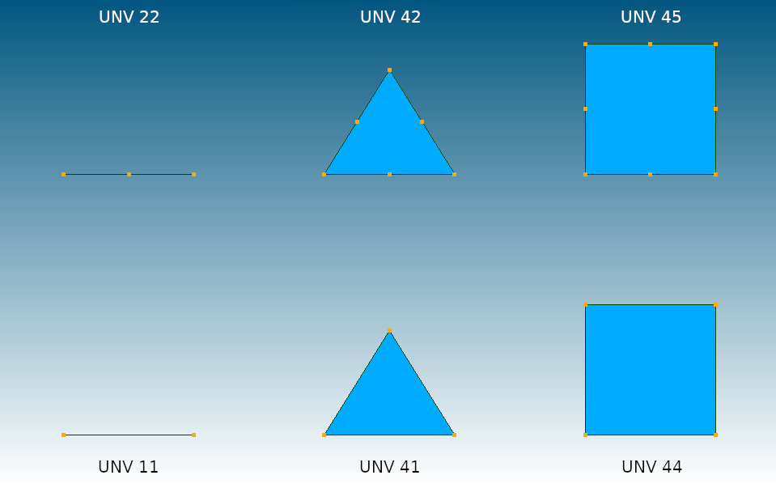
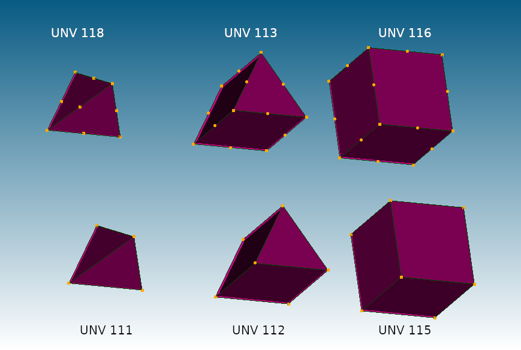

© Ihor Mirzov, 2019-2020  
Distributed under GNU General Public License v3.0

  

---

[Downloads](https://github.com/calculix/unv2ccx/releases) |
[How to use](#how-to-use) |
[Screenshots](#screenshots) |
[Your help](#your-help) |
[For developers](#for-developers)
[TODO](#todo)

---

  

# Salome to CalculiX converter (unv to inp)

Converts [Salome](https://www.salome-platform.org/) .unv file to [CalculiX](http://dhondt.de/) .inp format.

This converter is based on Joël's Cugnoni UNV parser available with [CalculiX Launcher](http://www.calculixforwin.com/) distribution. I allowed myself to slightely improve it and translate into Python 3. INPWriter's methods are fully refactored and now allow to convert beams. See folder [examples](./examples) for list of tested UNV elements. All generated INP files are processed by CalculiX GraphiX and [CalculiX Adanced Environment](https://github.com/calculix/cae) without any errors.

Thanks to [Niclas Stenberg](https://github.com/Xnst) for fixing bug with empty sets.

  

# How to use

Download Linux and Windows binaries from the [releases page](https://github.com/calculix/unv2ccx/releases). Binaries don't need to be installed.

Result INP-file name is the same as UNV-file name. So only one argument should be passed to the converter:

    in Linux:       ./unv2ccx file.unv
    in Windows:     unv2ccx.exe file.unv

  

# Screenshots

2D UNV elements converted to INP:  

3D UNV elements converted to INP:  

  

# Your help

Please, you may:

- Simply use this software and ask questions.
- Share your models and screenshots.
- Report problems by [posting issues](https://github.com/calculix/unv2ccx/issues).

  

# For developers

To run this converter from source you'll need [Python 3](https://www.python.org/downloads/).

Install package with command:

    pip3 install unv2ccx

In your code use unv2ccx package in this way:

    import unv2ccx
    c = unv2ccx.Converter(unv_file_name)
    c.run()

Create binary with [pyinstaller](https://www.pyinstaller.org/) (both in Linux and in Windows):

    pip3 install pyinstaller
    pyinstaller ./unv2ccx/__init__.py --onefile

Read [here](https://packaging.python.org/tutorials/packaging-projects/) about how to create Python packages:

    python3 -m pip install --user --upgrade setuptools wheel
    python3 setup.py sdist bdist_wheel
    twine upload dist/*

  

# TODO

Multiprocessing for tests.

